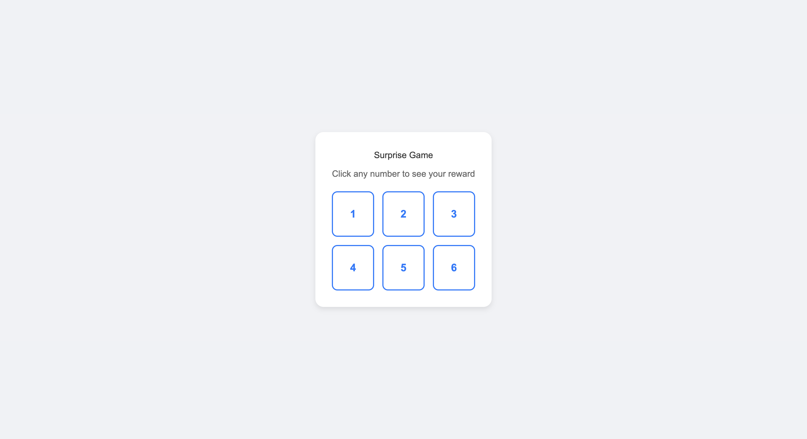
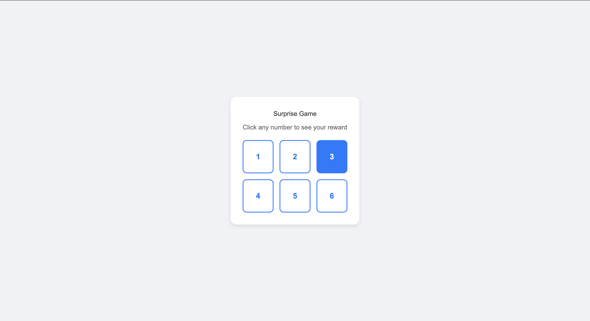
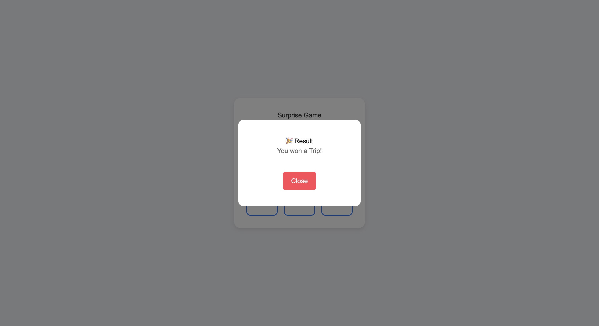

# Surprise Game 🎲

A fun and interactive React-based surprise game where users click on numbered boxes to reveal exciting rewards!

## 🎮 About

Surprise Game is a simple yet engaging web application built with React, TypeScript, and Vite. The game features a 3x2 grid of numbered boxes, each containing a hidden surprise. Players click on any box to reveal their prize in a beautiful modal popup.

## ✨ Features

- **Interactive Gameplay**: Click on numbered boxes to reveal rewards
- **Beautiful UI**: Clean, modern design with smooth hover effects
- **Modal Popups**: Elegant reward display with overlay effect
- **Responsive Design**: Works seamlessly on different screen sizes
- **TypeScript**: Fully typed for better development experience

## 🏆 Available Rewards

- 🚗 Car
- 🏍️ Bike  
- ✈️ Trip
- 💻 Laptop
- 📱 Phone
- ⌚ Watch

## 🛠️ Tech Stack

- **React 19** - Modern React with latest features
- **TypeScript** - Type-safe JavaScript
- **Vite** - Fast build tool and development server
- **Tailwind CSS** - Utility-first CSS framework
- **CSS3** - Custom styling with animations

## 📸 Screenshots

> **Note**: Screenshots need to be added manually. See `screenshots/README.md` for instructions.

### Main Game Interface


The main game screen shows a clean interface with the title "Surprise Game" and a 3x2 grid of numbered boxes ready to be clicked.

### Interactive Hover Effects


Each box features smooth hover animations that change the background color to blue and text to white, providing visual feedback to users.

### Reward Popup


When a box is clicked, a beautiful modal popup appears with the reward message and a close button to return to the game.

## 🚀 Getting Started

### Prerequisites

- Node.js (version 18 or higher)
- npm or yarn

### Installation

1. Clone the repository:
```bash
git clone <repository-url>
cd PR-1
```

2. Install dependencies:
```bash
npm install
```

3. Start the development server:
```bash
npm run dev
```

4. Open your browser and navigate to `http://localhost:5173`

### Building for Production

```bash
npm run build
```

The built files will be in the `dist` directory.

## 🎯 How to Play

1. Open the game in your browser
2. Click on any numbered box (1-6)
3. Wait for the surprise reward to be revealed
4. Click "Close" to return to the main game
5. Try different boxes to discover all rewards!

## 📁 Project Structure

```
src/
├── App.tsx          # Main application component
├── Box.tsx          # Individual box component
├── style.css        # Custom styles
├── index.css        # Base styles
└── main.tsx         # Application entry point
```

## 🎨 Customization

### Adding New Rewards

To add new rewards, modify the `App.tsx` file:

```tsx
<Box text="7" msg="You won a Tablet!" onBoxClick={handleBoxClick} />
```

### Changing Colors

Update the CSS variables in `style.css`:

```css
.simple-box {
  border-color: #your-color;
  color: #your-color;
}

.simple-box:hover {
  background: #your-color;
  color: white;
}
```

## 🔧 Development

### Available Scripts

- `npm run dev` - Start development server
- `npm run build` - Build for production
- `npm run lint` - Run ESLint
- `npm run preview` - Preview production build

### Code Quality

The project includes ESLint configuration for maintaining code quality and consistency.

## 📄 License

This project is licensed under the MIT License.

https://github.com/CodeWithRushii/Licence

## 🤝 Contributing

Contributions are welcome! Please feel free to submit a Pull Request.

## 📞 Support

If you have any questions or feedback, please open an issue on the repository.
